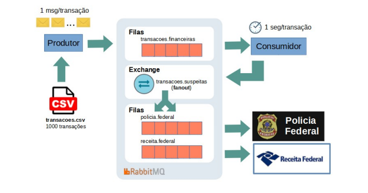

# AMQP-Project

A aplicação foi desenvolvida como um sistema distribuído com um Produtor e um Consumidor. O Produtor lê um arquivo CSV contendo dados de transações financeiras e os converte em eventos. Esses eventos são enviados para a fila "transacoes.financeiras". O Consumidor recebe os eventos da fila e processa cada transação, simulando uma espera de 1 segundo. Os dados processados são impressos na saída padrão.

Essa abordagem permite o processamento distribuído das transações, com o Produtor convertendo e enviando os eventos e o Consumidor recebendo e processando de forma assíncrona.

A implementação utiliza o RabbitMQ para a comunicação entre os componentes, utilizando filas para troca de mensagens.

 

